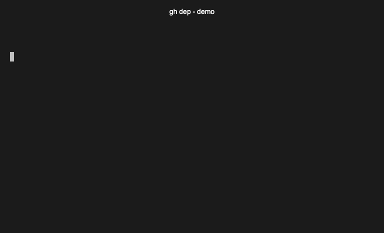

# gh-dep

[](https://github.com/jackchuka/gh-dep/actions)
[](https://goreportcard.com/report/github.com/jackchuka/gh-dep)

A GitHub CLI extension that streamlines the review and merge workflow for automated dependency update PRs.



## [2025-10-20] Important Update: Dependabot mode Deprecation

**GitHub is deprecating Dependabot comment commands on January 27, 2026** ([announcement](https://github.blog/changelog/2025-10-06-upcoming-changes-to-github-dependabot-pull-request-comment-commands/)). Commands like `@dependabot merge`, `@dependabot squash and merge`, etc. will no longer work.

`gh-dep` will no longer support the Dependabot merge mode after v0.7.0.

## Features

- 🖥️ **Interactive TUI**: Full-featured terminal UI with keyboard navigation and live settings adjustment
- 📋 **List** dependency PRs by label/author with clean table output
- 📦 **Group** PRs by `package@version` for easier batched review
- ✅ **Bulk approve** all PRs for a chosen group
- 🚀 **Bulk merge** per group via GitHub Merge API calls (with optional CI validation)
- 🏢 **Multi-repo support**: Target specific repos or entire organizations
- 🔄 Works out-of-the-box with **Dependabot** and **Renovate**
- 🎨 **Multiple output formats**: Human-readable tables or JSON
- ⚙️ **Configuration support**: Save default repos and custom patterns via `gh config`
- 🎯 **Custom patterns**: Define your own PR title patterns for grouping

## Installation

### Prerequisites

- [GitHub CLI](https://cli.github.com/) (`gh`) version 2.x or later
- Go 1.21 or later (for building from source)

### Install from GitHub

```bash
gh extension install jackchuka/gh-dep
```

### Install from Source

```bash
# Clone the repository
git clone https://github.com/jackchuka/gh-dep.git
cd gh-dep

# Build the extension
go build -o gh-dep

# Install as a gh extension
gh extension install .
```

## Quick Start

### Interactive Mode (Recommended)

```bash
# Launch interactive TUI for your org repos
gh dep

# Or for repo[s]
gh dep --repo owner/app,owner/api

# Or for an entire organization
gh dep --owner myorg
```

**In the TUI, you can:**

- Navigate with `↑/↓` or `j/k`
- Select PRs with `space` or `a` (select all)
- Toggle action mode with `m` (Approve → Merge → Approve & Merge)
- Adjust merge settings on-the-fly:
  - `M` - Toggle merge method (squash → merge → rebase)
  - `c` - Toggle CI checks requirement
- Search PRs with `/`
- Open current PR in browser with `o`
- Execute selected actions with `x`
- View help with `?`

### CLI Mode

```bash
# List and group dependency PRs in a single repo
gh dep list --repo owner/app --group

# Output:
# GROUP              REPO      PR     URL
# lodash@4.17.21    app       #123   https://github.com/owner/app/pull/123
#                   api       #129   https://github.com/owner/api/pull/129
#                   web       #131   https://github.com/owner/web/pull/131
# axios@1.7.3       app       #118   https://github.com/owner/app/pull/118
#                   api       #122   https://github.com/owner/api/pull/122

# View cached groups
gh dep groups

# Approve all PRs in a group (dry-run first)
gh dep approve --group lodash@4.17.21 --dry-run

# Approve for real
gh dep approve --group lodash@4.17.21

# Merge with CI check validation (--require-checks is true by default)
gh dep merge --group lodash@4.17.21 --method squash
```

## Usage

### Commands

#### Main Command - Interactive TUI (Recommended)

```bash
gh dep [flags]
```

Launch an interactive terminal UI for managing dependency PRs with:

- **Multi-select**: Use `space` to toggle, `a` to select all, `d` to deselect all
- **Navigation**: `↑/↓` or `j/k` to move, `o` to open PR in browser
- **Search**: Press `/` to filter PRs by title, repo, or number
- **Live Settings**: Toggle execution mode and merge settings without restarting
  - `m` - Action mode (Approve → Merge → Approve & Merge)
  - `M` - Merge method (squash → merge → rebase)
  - `c` - CI checks requirement
- **Execute**: Press `x` to run selected actions with real-time feedback
- **Help**: Press `?` to view all keyboard shortcuts

**Flags:**

- `--bot` - Dependency bot to target: `dependabot` (default) or `renovate` (skips author filter)
- `--author` - PR author to filter (overrides `--bot`)
- `--label` - PR label to filter
- `--review-requested` - Filter PRs by review requested from user or team (e.g., `@me` or `username`)
- `--archived` - Include PRs from archived repositories (default: false)
- `--limit` - Max PRs to fetch per repo (default: 200)
- `--repo` / `-R` - Target repo(s), comma-separated
- `--owner` - Target all repos in an organization
- `--mode` - Initial execution mode: `approve`, `merge`, or `approve-and-merge` (default: `approve`)
- `--merge-method` - Initial merge method (default: `squash`)
- `--require-checks` - Initial CI checks setting

**Examples:**

```bash
# Launch TUI for a single repo
gh dep --repo owner/app

# Launch for entire organization with custom initial settings
gh dep --owner myorg --merge-method rebase

# Target Renovate PRs without remembering the login name
gh dep --owner myorg --bot renovate

# Start in merge mode instead of approve mode
gh dep --repo owner/app --mode merge

# Start in approve-and-merge mode
gh dep --repo owner/app --mode approve-and-merge

# Filter by label
gh dep --repo owner/app --label dependencies

# Filter PRs where review is requested from you
gh dep --repo owner/app --review-requested @me

# Include PRs from archived repositories
gh dep --owner myorg --archived
```

#### `list` - List dependency PRs

```bash
gh dep list [flags]
```

**Flags:**

- `--bot` - Dependency bot to target: `dependabot` (default) or `renovate` (skips author filter)
- `--author` - PR author to filter (overrides `--bot`)
- `--label` - PR label to filter
- `--review-requested` - Filter PRs by review requested from user or team (e.g., `@me` or `username`)
- `--archived` - Include PRs from archived repositories (default: false)
- `--group` - Group PRs by package@version and cache results
- `--json` - Output as JSON
- `--limit` - Max PRs to fetch per repo (default: 200)
- `--repo` / `-R` - Target repo(s), comma-separated (e.g., `owner/repo1,owner/repo2`)
- `--owner` - Target all repos in an organization

#### `groups` - Show cached groups

```bash
gh dep groups [flags]
```

**Flags:**

- `--json` - Output as JSON

Shows the groups from the last `list --group` command without fetching from GitHub.

#### `approve` - Bulk approve PRs

```bash
gh dep approve --group GROUP_KEY [flags]
```

**Flags:**

- `--group` - **Required.** Group key (e.g., `lodash@4.17.21`)
- `--dry-run` - Print actions without executing
- `--repo` / `-R` - Target repo(s) (uses cache if omitted)
- `--org` / `-O` - Target organization (uses cache if omitted)

#### `merge` - Bulk merge PRs

```bash
gh dep merge --group GROUP_KEY [flags]
```

**Flags:**

- `--group` - **Required.** Group key (e.g., `lodash@4.17.21`)
- `--method` - Merge method: `merge`, `squash`, or `rebase` (default: `squash`)
- `--require-checks` - Require CI checks to pass before merging
- `--dry-run` - Print actions without executing

**Examples:**

```bash
# Merge with CI validation (recommended)
gh dep merge --group lodash@4.17.21 --method squash

# Dry-run merge
gh dep merge --group lodash@4.17.21 --dry-run
```

## Configuration

Save default configuration to avoid passing flags every time:

```bash
# Set default repos
gh config set dep.repo "myorg/app,myorg/api,myorg/web"

# Set custom PR title patterns (comma-separated regexes with 2 capture groups: package, version)
gh config set dep.patterns "bump\s+([^\s]+)\s+from\s+[^\s]+\s+to\s+v?(\d+(?:\.\d+)?(?:\.\d+)?)"

# View current config
gh config get dep.repo
```

When flags are not provided, `gh dep` will use these defaults.

## Multi-Repo & Organization Support

### Explicit Repo List

```bash
# Group across multiple repos
gh dep list --group --repo myorg/app,myorg/api,myorg/web

# Output:
# GROUP              REPO      PR     URL
# lodash@4.17.21    app       #123   https://github.com/myorg/app/pull/123
#                   app       #129   https://github.com/myorg/app/pull/129
#                   app       #131   https://github.com/myorg/app/pull/131
#                   api       #45    https://github.com/myorg/api/pull/45
# axios@1.7.3       app       #118   https://github.com/myorg/app/pull/118
#                   app       #122   https://github.com/myorg/app/pull/122

# Approve across all repos
gh dep approve --group lodash@4.17.21
```

### Organization-Wide

```bash
# List all dependency PRs across entire org
gh dep list --group --owner myorg

# Approve/merge org-wide
gh dep approve --group lodash@4.17.21
gh dep merge --group lodash@4.17.21 --require-checks
```

## Supported PR Title Patterns

The tool automatically parses titles from:

### Dependabot

- `Bump <pkg> from X to Y`
- `chore(deps): bump <pkg> from X to Y`
- `Update <pkg> to vY`

### Renovate

- `Update dependency <pkg> to vY`
- `chore(deps): update <pkg> to vY`

### Custom Patterns

Define your own patterns via `gh config`:

```bash
gh config set dep.patterns "your-pattern-here,another-pattern"
```

**Pattern requirements:**

- Must be valid regex
- Must have exactly 2 capture groups: `(package)` and `(version)`
- Multiple patterns can be comma-separated

**Example custom patterns:**

```bash
# Match "deps: upgrade foo to 1.2.3"
gh config set dep.patterns "deps:\s+upgrade\s+([^\s]+)\s+to\s+(\d+(?:\.\d+)?(?:\.\d+)?)"

# Match single-digit versions like "bump actions/setup-go from 5 to 6"
gh config set dep.patterns "bump\s+([^\s]+)\s+from\s+[^\s]+\s+to\s+(\d+(?:\.\d+)?(?:\.\d+)?)"
```

**Unknown titles** are grouped as `unknown@unknown` for manual review.

## Cache

Groups are cached at:

```
${XDG_CACHE_HOME:-$HOME/.cache}/gh-dep/groups.json
```

Cache is overwritten on each `list --group` execution.

## Output Formats

### Human-Readable Tables

Default output uses GitHub CLI's table formatter for clean, aligned columns:

```bash
# Flat list
gh dep list
# Output:
# REPO                           PR     TITLE
# tailor-platform/app-shell     #112   chore(deps-dev): bump tw-animate-css from 1.2.5 to 1.4.0
# tailor-platform/app-shell     #111   chore(deps-dev): bump typescript-eslint from 8.28.0 to 8.44.1

# Grouped (single table)
gh dep list --group
# Output:
# GROUP                          REPO           PR     URL
# tw-animate-css@1.4.0          app-shell      #112   https://github.com/tailor-platform/app-shell/pull/112
# typescript-eslint@8.44.1      app-shell      #111   https://github.com/tailor-platform/app-shell/pull/111
```

### JSON Output

Use `--json` for machine-readable output:

```bash
# Flat list as JSON array
gh dep list --json

# Grouped as JSON object
gh dep list --group --json
# Output:
# {
#   "tw-animate-css@1.4.0": [
#     {
#       "number": 112,
#       "title": "chore(deps-dev): bump tw-animate-css from 1.2.5 to 1.4.0",
#       "author": "dependabot[bot]",
#       "repo": "tailor-platform/app-shell",
#       "url": "https://github.com/tailor-platform/app-shell/pull/112"
#     }
#   ]
# }
```

## Development

### Build

```bash
go build -o gh-dep
```

### Test

```bash
go test ./...
```

### Run Locally

```bash
./gh-dep --help
```

## Contributing

Contributions welcome! Please:

1. Fork the repository
2. Create a feature branch
3. Add tests for new functionality
4. Ensure `go test ./...` passes
5. Submit a pull request

## License

MIT License - see [LICENSE](LICENSE) for details.

## Acknowledgments

Built with:

- [GitHub CLI](https://cli.github.com/)
- [go-gh](https://github.com/cli/go-gh) - Official GitHub CLI library and table formatter
- [Cobra](https://github.com/spf13/cobra) - CLI framework
- [Bubble Tea](https://github.com/charmbracelet/bubbletea) - TUI framework
- [Bubbles](https://github.com/charmbracelet/bubbles) - TUI components
- [Lipgloss](https://github.com/charmbracelet/lipgloss) - TUI styling

---

**Made with ❤️ for dependency management automation**
